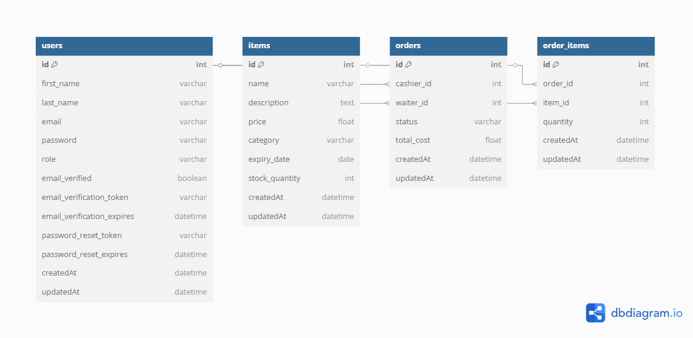

## Project Idea: **Restaurant Inventory & Order Management System**

A backend system designed for managing restaurant operations, focused on inventory, orders, and staff roles, with built-in reporting and automation features.

### Key Points:

* **User Roles & Authentication:**
  Different user roles (Super Admin, Manager, Cashier, Waiter) with controlled access and permissions. Secure login, email verification, and password reset.

* **Item/Inventory Management:**
  Admins and managers can add, edit, and delete items (food, beverages, others) with detailed attributes (price, expiry date, stock). Waiters can only view non-expired items.
  Notifications for items nearing expiry and preventing expired items from being ordered.

* **Order Management:**
  Cashiers handle customer orders by adding/removing items, setting quantities, marking completion, and assigning waiters. The system calculates total cost and automatically expires pending orders after a time limit.

* **Commission Reporting:**
  Generate detailed reports on waiter sales, commissions by category, with export options (JSON/CSV). Role-based data visibility (e.g., waiters see only their own data).

* **CSV Import/Export:**
  Bulk import/export of item data for easy management by admins/managers.

## Getting Started

### Prerequisites

- Node.js (v22.11.0)

### Installation

```bash
git clone https://github.com/Ahmedali64/orders-system.git
cd ./orders-system
npm install
```

### Environment Setup

* Create a `.env` file in the root directory and configure your database settings.
* You can use `.env.example` as a reference 

## Database ERD



### Database Migration

Before running the application, apply all database migrations:

**You should be in the config folder directory**  
```bash
npx sequelize db:create
```

```bash
npx sequelize db:migrate:all
```

If you want to add some items to your database for testing run this 

```bash
npx sequelize db:seed:all
```

To undo the last migration:

```bash
npx sequelize db:migrate:undo
```

### Docker Services

To start RabbitMQ and Redis using Docker Compose:

```bash
docker-compose up -d
```

Make sure your `.env` is configured to match the Docker service names if running your app in Docker.

### Running the Application
Run each one of them in a separate terminal

```bash
npm worker
```

```bash
npm start
```
If you want to run server on auto restart mode when you make any changes run this instead 
of `npm start`
```bash
npm run dev 
```

## API Documentation

Full API documentation (with example requests and responses) is available here:  
[View in Postman](https://documenter.getpostman.com/view/21578024/2sB2x2LunG)

## Contribution Workflow

Before committing code to GitHub:

- Ensure all migrations are up to date and tested.
- Run all tests and lint your code.
- Update documentation if you add or change features.
- Follow commit message guidelines if any.

---

